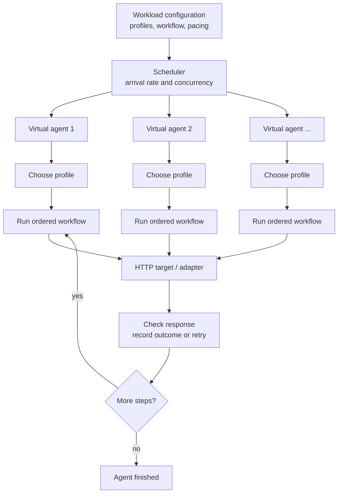
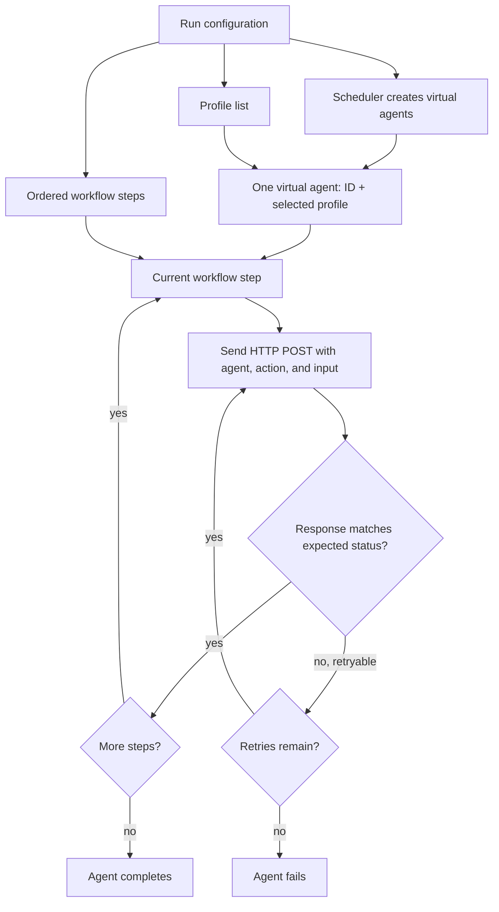
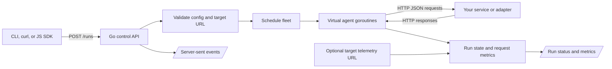

# Janky

Janky is a small HTTP workload generator for testing services that handle agent-shaped workflows. You describe a set of virtual agents, the steps they take, and how quickly they start. Janky replays those workflows against your HTTP endpoint and reports what happened.

## Why Janky?

Testing an agent-facing service with real LLM agents can be slow, costly, and hard to reproduce: model output, tool choices, and response times vary between runs. Janky lets you test the service and its adapter with a fixed workload first. Every run uses the actions and inputs you provide, so you can compare behavior as you change the service or workload.

Janky simulates the workflow traffic; it does not run an LLM or invent actions. It is useful for local development, integration checks, and controlled load experiments.

## Why not use a standard load tester?

Tools such as [k6](https://grafana.com/docs/k6/latest/using-k6/scenarios/) are excellent for generating HTTP traffic and scheduling virtual users or arrival rates; they also support [performance thresholds](https://grafana.com/docs/k6/latest/using-k6/thresholds/). They can script multi-step flows. The difference is the workload model Janky provides out of the box.

For an agent-facing service, the useful unit is often one agent completing a task: a stable agent identity and profile, an ordered sequence of named actions and inputs, an expected response at each step, and a consistent retry policy. Janky treats that sequence as the test case. With a general-purpose load tester, you can build the same behavior in a script, but the script must define and maintain that agent state machine and request envelope itself.

Use Janky when you want to exercise an agent workflow through your HTTP adapter without running real LLMs or writing a custom load-test harness for the workflow. Use k6 or another general-purpose tester when you need broader protocol support, threshold expressions, or traffic models beyond Janky's scripted HTTP workflows. They solve related problems and can be used at different stages of testing.

## How an agent run works

For a fleet run, Janky schedules virtual agents at the requested arrival rate and runs up to the configured concurrency. Each agent takes a profile, sends its workflow steps in order, and waits for each response before moving on. Think time and jitter can spread requests out. Unexpected network errors, `429` responses, and `5xx` responses can be retried.



Each step is a JSON `POST` containing the agent ID, selected profile, workflow ID, action, and input. The target can route different actions through the same endpoint. Janky drains and discards target response bodies, then records status, latency, and retry results.

### How Janky represents an agent

An agent is a simulated identity plus a profile and an ordered workflow. For a fleet run, Janky creates the configured number of agents; each gets a profile from the configured list and follows the workflow in order. It does not call an LLM, choose tools, or derive its next action from the target's response.



For example, this configuration defines the inputs Janky uses to represent each virtual agent:

```json
{
  "name": "example",
  "agents": 50,
  "profiles": [{"group": "A", "level": "standard"}],
  "workflow": [
    {"action": "step_one", "input": {"value": "example"}},
    {"action": "step_two", "input": {"value": "example"}}
  ]
}
```

Each target request carries that agent's ID and profile, a workflow ID and step number, and the step's action and input. Janky waits for each response before advancing. Expected status codes determine success; network errors, `429`, and `5xx` responses can be retried according to the run's retry setting. Think time and jitter add pauses between steps. These controls make the traffic repeatable while leaving the service's actual decisions outside Janky.

## System at a glance



Janky runs as one Go process. Fleet traffic and direct agent invocations can run at the same time. The API binds to loopback by default, and outbound target hosts must be allowed. See [architecture](docs/architecture.md) for the API and security boundary.

## What it looks like in practice

Start Janky:

```sh
go run ./cmd/janky 3000
```

Submit a hundred virtual agents. This example sends each agent through a lookup step and then a read step against an adapter on port 4000:

```sh
curl -s http://127.0.0.1:3000/runs \
  -H 'content-type: application/json' \
  -d '{
    "target_url": "http://127.0.0.1:4000/events",
    "agents": 100,
    "concurrency": 20,
    "arrival_rate": 10,
    "profiles": [{"tenant": "synthetic-a"}, {"tenant": "synthetic-b"}],
    "workflow": [
      {"action": "lookup", "input": {"record": "synthetic-1"}},
      {"action": "read", "input": {"record": "synthetic-1"}}
    ]
  }'
```

Janky returns a run ID:

```json
{"run_id":"<run-id>","status_url":"/runs/<run-id>"}
```

Use the returned `status_url` to see progress and final counts:

```sh
RUN_ID="paste-the-returned-run-id-here"
curl -s "http://127.0.0.1:3000/runs/${RUN_ID}"
```

The response reports agent totals and request metrics, including successes, failures, retries, timeouts, average latency, and p95 latency. `/events` streams live lifecycle and request events; `/metrics` exposes Prometheus text metrics. For more workload examples, see [use cases](docs/use-cases.md) and [methodology](docs/methodology.md).

### Several teams in one run

Use `scenarios` to give each team its own agent count, profiles, and ordered workflow. By default, scenarios share the run's arrival rate and concurrency limit, and their agents are interleaved. Each target receives a `scenario` field in its requests. The run status includes agent counts for each scenario as well as the existing totals.

```json
{
  "target_url": "http://127.0.0.1:4000/events",
  "concurrency": 20,
  "arrival_rate": 10,
  "scenarios": [
    {
      "name": "sales",
      "agents": 50,
      "profiles": [{"team": "sales"}],
      "workflow": [{"action": "find_lead"}, {"action": "create_quote"}]
    },
    {
      "name": "support",
      "agents": 50,
      "profiles": [{"team": "support"}],
      "workflow": [{"action": "find_ticket"}, {"action": "reply"}]
    }
  ]
}
```

Submit this JSON to `POST /runs`. Scenario names must be unique and use letters, numbers, `_`, `.`, or `-`. Each scenario must specify `agents`, `profiles`, and `workflow`. The original single-workflow format still works; a request with `scenarios` cannot also set top-level `agents`, `profiles`, or `workflow`.

To pace teams independently, set `arrival_rate` or `concurrency` on a scenario. For example, add `"arrival_rate": 6, "concurrency": 4` to `sales` and `"arrival_rate": 2, "concurrency": 2` to `support` above. When any scenario sets either field, every scenario gets its own arrival schedule; omitted values inherit the run's values. The top-level `concurrency` remains a hard limit across the whole run. Arrival rates are scheduling targets: busy agents can delay later starts when a concurrency limit is full.

### Route workflows to different services

Define named HTTP endpoints in `targets`. A scenario's `target` selects its default endpoint; a step's `target` overrides it. A top-level `target_url` remains an optional fallback. Each step must resolve to an endpoint before the run starts.

```json
{
  "targets": {
    "crm": "http://127.0.0.1:4000/events",
    "support": "http://127.0.0.1:5000/events"
  },
  "scenarios": [
    {
      "name": "sales",
      "agents": 50,
      "target": "crm",
      "profiles": [{"team": "sales"}],
      "workflow": [
        {"action": "find_lead"},
        {"action": "check_ticket", "target": "support"}
      ]
    },
    {
      "name": "support",
      "agents": 50,
      "target": "support",
      "profiles": [{"team": "support"}],
      "workflow": [{"action": "reply"}]
    }
  ]
}
```

Target names use the same characters as scenario names. All endpoint URLs must use HTTP(S) and an allowed host. For workloads spanning live databases, point each target at the appropriate service or adapter; Janky sends HTTP requests to those endpoints.

### Inspect tags and set thresholds

Each run reports `tagged_requests`, grouping request attempts by configured scenario, action, and named target. Retries count as additional attempts. Tags do not include agent IDs, profiles, inputs, or endpoint URLs. `/metrics` keeps its existing aggregate Prometheus output.

Add optional `thresholds` to a run to set upper bounds for failure rate, client-observed p95 latency in milliseconds, or timeout count. Tags filter which attempts a threshold checks; omit `tags` to check the whole run:

```json
"thresholds": [
  {"metric": "failed_rate", "max": 0.01, "tags": {"scenario": "sales"}},
  {"metric": "latency_p95_ms", "max": 500, "tags": {"action": "find_lead", "target": "crm"}},
  {"metric": "timeouts", "max": 0}
]
```

`failed_rate` is failed attempts divided by all matching attempts; expected non-2xx responses count as successes. A threshold with no matching attempts fails. After the run finishes, `/runs/{id}` reports each threshold's `actual` value and `passed` result, plus `thresholds_passed`. If any threshold fails, the run's `state` is `failed`. Latency p95 uses bounded samples, so it is an estimate for large workloads.

## Capacity and safety

Janky has no configured count caps on agents, concurrency, arrival rate, profiles, workflow steps, retries, or simultaneous workloads. Each configuration request is limited to 64 KiB, `/events` allows up to 32 observers, and the server retains at most 100 completed run summaries (active runs remain queryable). Large workloads use more CPU, memory, and sockets, and can overwhelm the target; start with a workload appropriate for the environment and monitor both sides. Use synthetic data when testing services that contain user information.

The control API has no remote authentication layer. Keep it on trusted local tooling; do not expose it to untrusted callers.

## Project details

- Go HTTP API and workload runner; no third-party Go dependencies.
- Small dependency-free JavaScript ESM client in [`sdk/js/client.mjs`](sdk/js/client.mjs).
- Go tests are colocated with the source; SDK tests live in `sdk/js/`.
- [Documentation index](docs/README.md).

The API also provides `GET /health`, `GET /status`, `GET /events`, and `GET /metrics`; `POST /agents/{id}/invoke` advances a caller-managed agent workflow. The SDK wraps these endpoints along with fleet submission and run lookup.

## Development

```sh
go test -race -coverprofile=/tmp/janky.cover ./...
go tool cover -func=/tmp/janky.cover | awk '$1 == "total:" && $3 == "100.0%" { ok = 1 } END { exit !ok }'
node --test --experimental-test-coverage --test-coverage-exclude=sdk/js/client.test.mjs \
  --test-coverage-lines=100 --test-coverage-branches=100 \
  --test-coverage-functions=100 sdk/js/client.test.mjs
```
